<div align="center">
  <a href="https://github.com/adamSHA256/Tidybill">
    
  </a>
  <p><strong>Clean invoices, zero clutter.</strong></p>
  <p>Local-first invoice manager for freelancers — CLI + Desktop GUI, 3 languages.</p>
  <p>
    <a href="https://github.com/adamSHA256/Tidybill/releases/latest">
      
    </a>
  </p>
</div>

---

## Desktop App

<table>
<tr>
<td>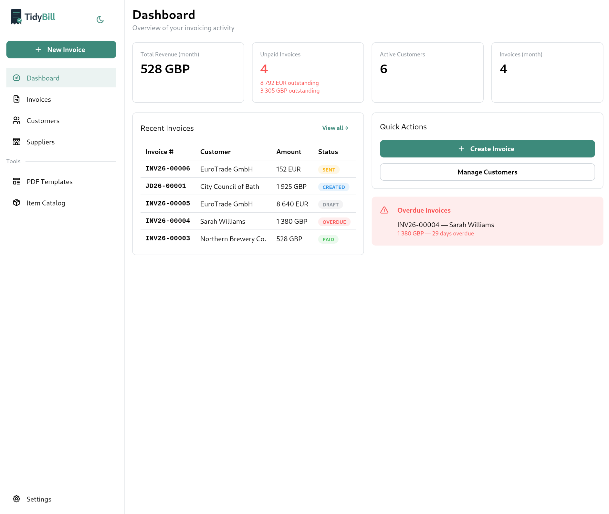</td>
<td>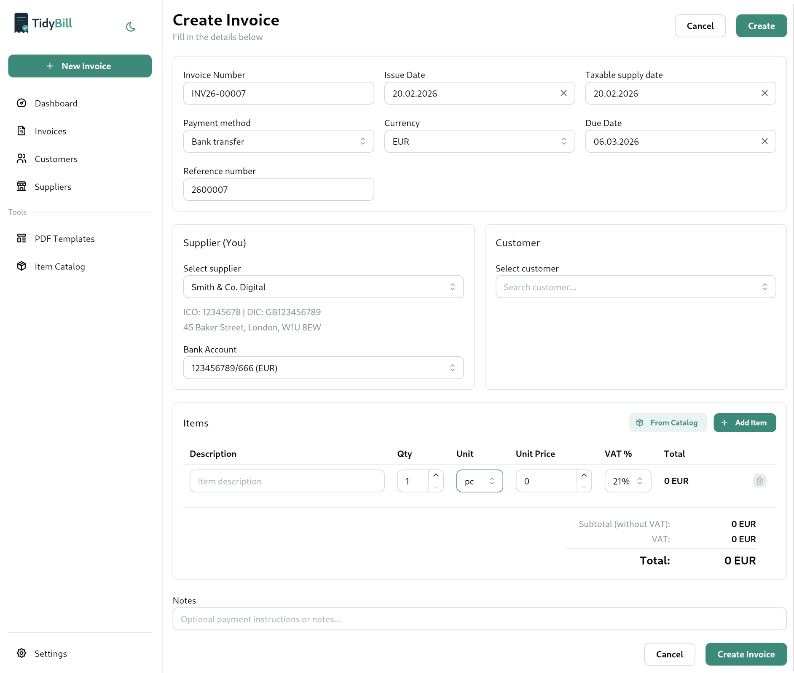</td>
</tr>
<tr>
<td align="center"><em>Dashboard</em></td>
<td align="center"><em>Create Invoice</em></td>
</tr>
</table>

<details>
<summary>More screenshots</summary>

<table>
<tr>
<td>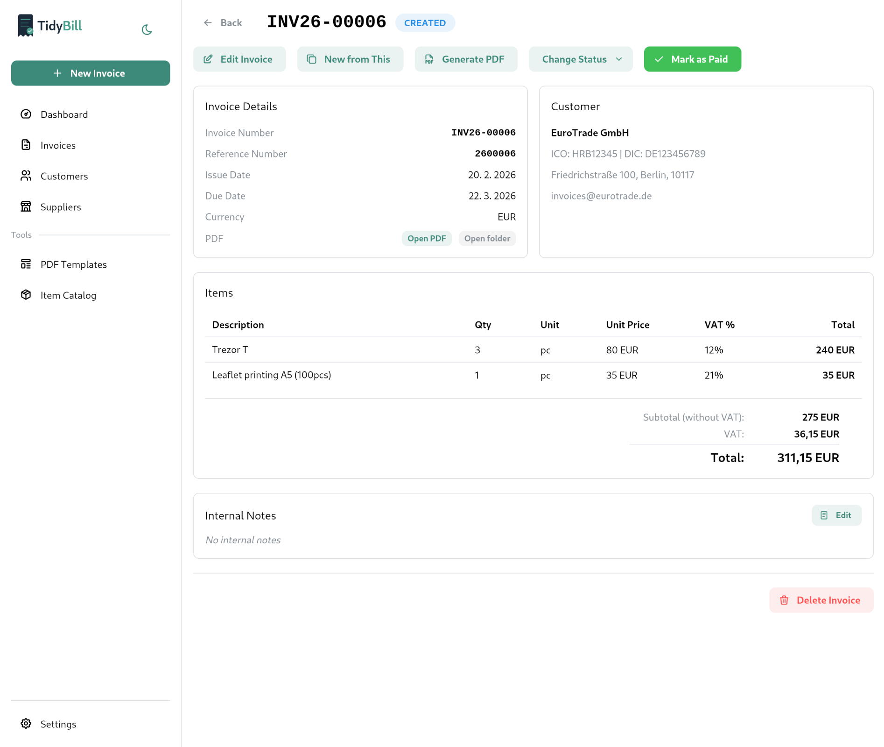</td>
<td>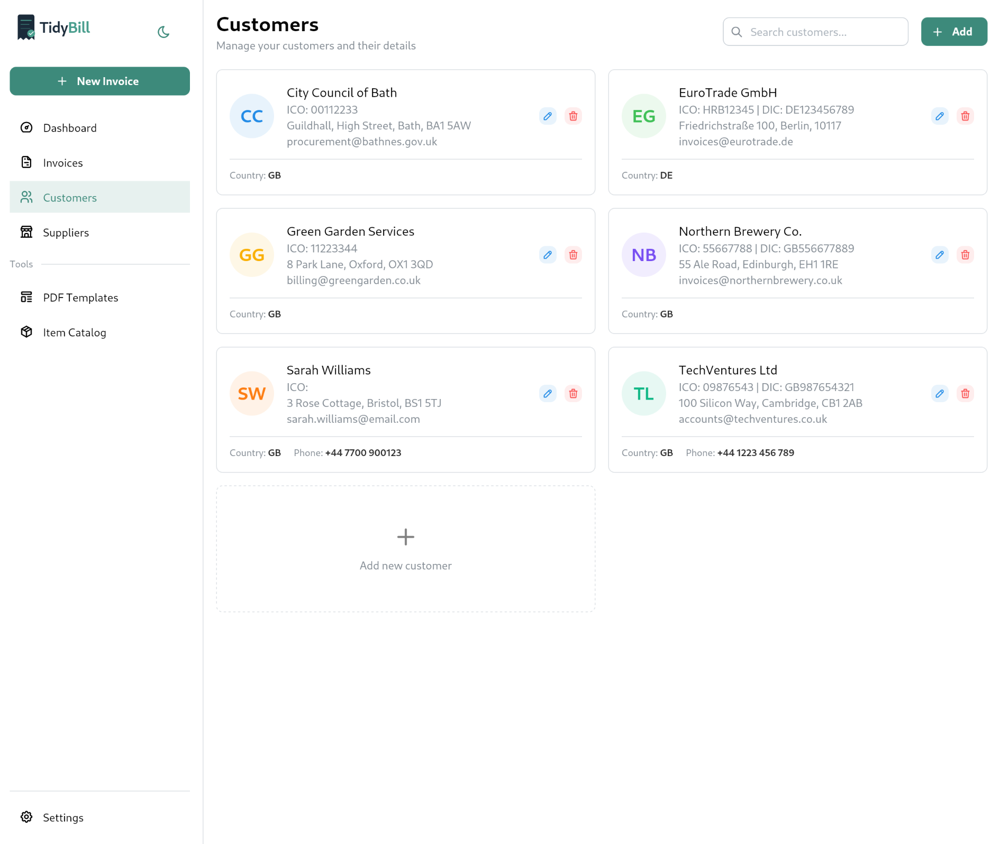</td>
</tr>
<tr>
<td align="center"><em>Invoice Detail</em></td>
<td align="center"><em>Customers</em></td>
</tr>
</table>

### Smart warnings & intuitive environment

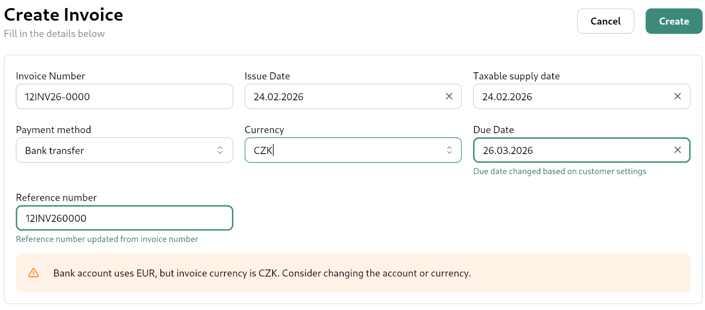

### Invoice PDF templates

<table>
<tr>
<td>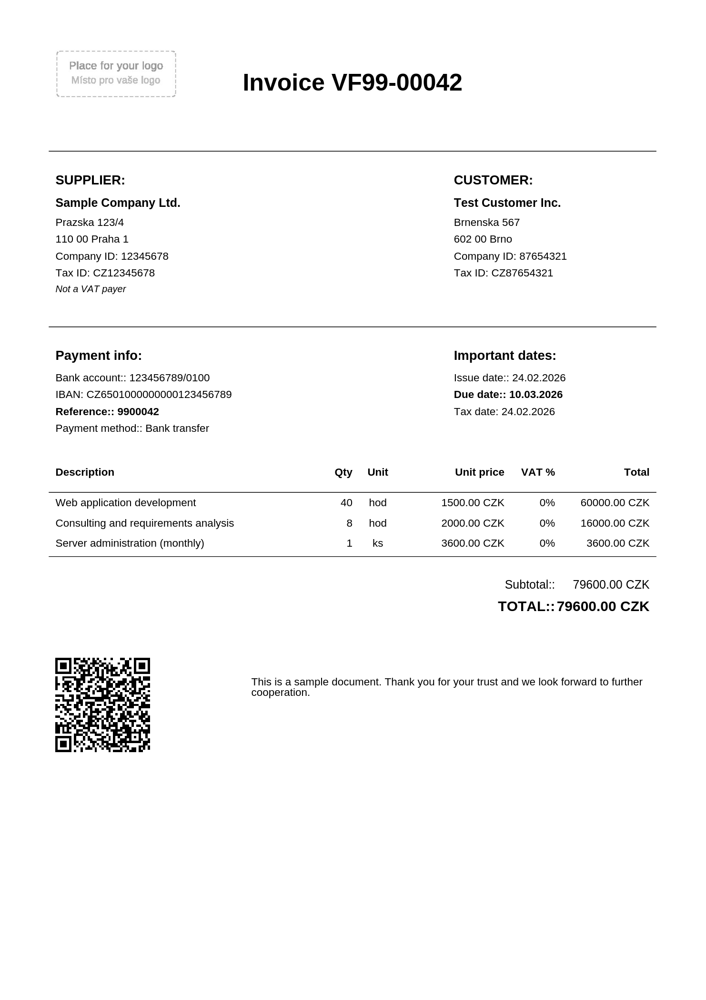</td>
<td>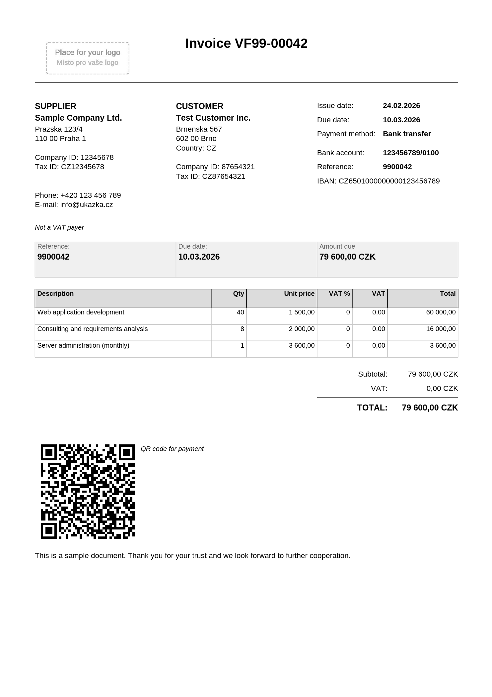</td>
<td>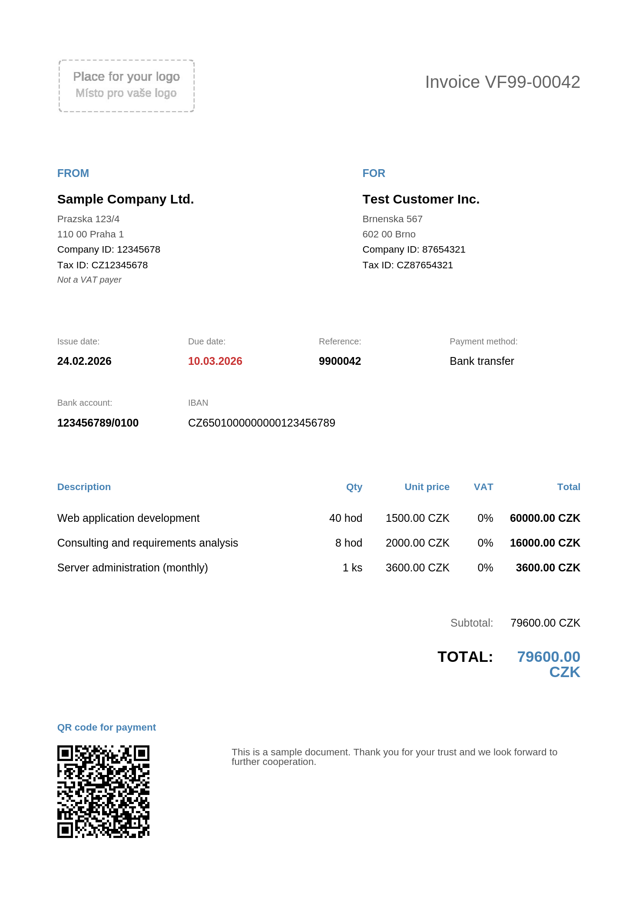</td>
</tr>
<tr>
<td align="center"><em>Classic</em></td>
<td align="center"><em>Tables</em></td>
<td align="center"><em>Modern</em></td>
</tr>
</table>

### PDF template management

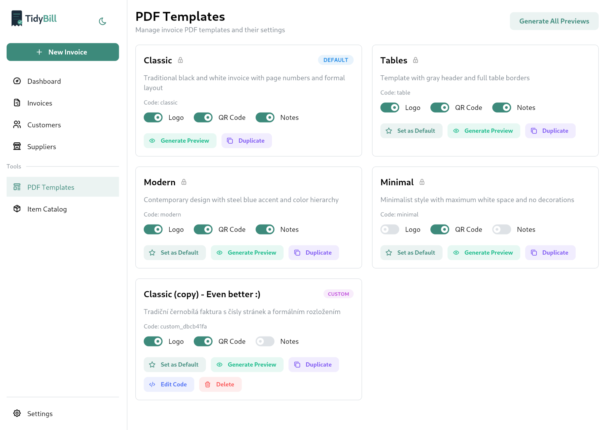

### Template editor

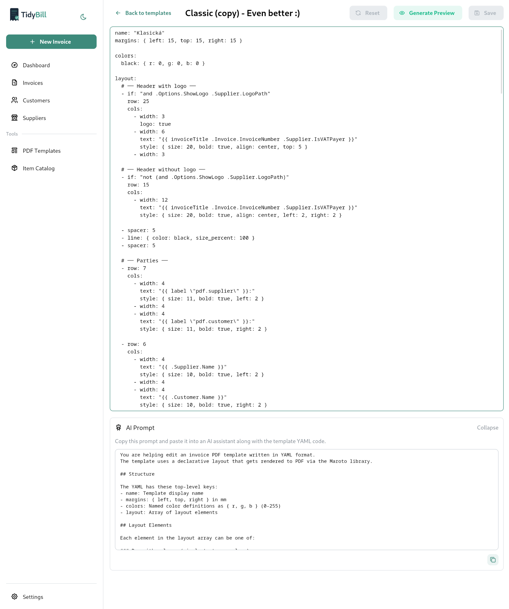

### Suppliers & bank accounts

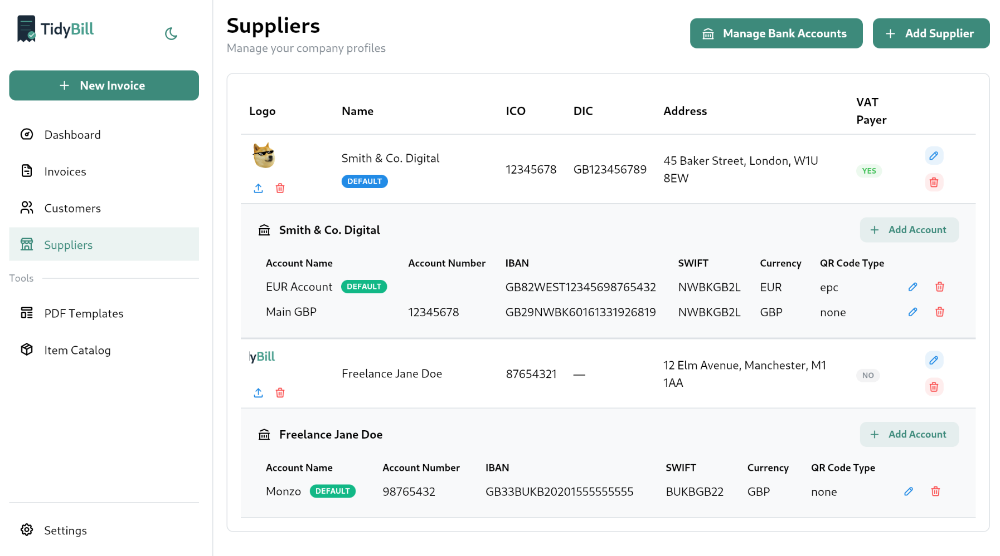

</details>

## CLI

```
╔═════════════════════════════════════════════════════════════╗
║                     TIDYBILL v0.1.5                          ║
║  Company: Smith & Co. Digital                               ║
╠═════════════════════════════════════════════════════════════╣
║                                                             ║
  1) Create new invoice
  2) Create invoice from existing
  3) Invoice list
  4) Unpaid invoices                     [4 unpaid, 1 overdue]
  5) Customers
  6) Item catalog
  7) Suppliers (your companies)
  8) Sync / Import / Export
  9) PDF templates
  S) Settings
  W) Overview
  0) Quit
```

<details>
<summary>Invoice list</summary>

```
=== INVOICE LIST ===

  1) 📝 INV26-00005 | 18.02.2026 | EuroTrade GmbH        |   8 640.00 EUR
  2) 📄 JD26-00001  | 08.02.2026 | City Council of Bath  |   1 925.00 GBP
  3) 📄 INV26-00003 | 01.02.2026 | Northern Brewery Co.  |     528.00 GBP
  4) ✅ INV26-00002 | 18.01.2026 | Green Garden Services |   3 800.00 GBP
  5) ⚠️ INV26-00004  | 08.01.2026 | Sarah Williams        |   1 380.00 GBP
  6) ✅ INV26-00001 | 03.01.2026 | TechVentures Ltd      |  11 280.00 GBP

  F) Filter
  0) Back
```

</details>

<details>
<summary>Creating an invoice</summary>

```
══════════════════════════════════════════════════════════════
                      INVOICE SUMMARY
══════════════════════════════════════════════════════════════
  Invoice number:  INV26-00006
  Customer:        EuroTrade GmbH
  Date:            20.02.2026
  Due date:        22.03.2026

  Items:
    1x  Algo                         100.00 EUR  →  110.00 EUR
    1x  Leaflet printing A5 (100pcs)  35.00 EUR  →   42.00 EUR

                                Subtotal:   135.00 EUR
                                VAT:         17.00 EUR
                                ─────────────────────
                                TOTAL:      152.00 EUR
══════════════════════════════════════════════════════════════

  U) Save invoice
  Z) Cancel

  Choice [u]: u

  ✓ Invoice INV26-00006 created!
  Generate PDF? [Y/n]: y
  ✓ PDF created: ~/PATH/COMPANY/2026/INV26-00006.pdf
  Open PDF? [Y/n]: y
```

</details>

## Features

- **Full CLI + Desktop GUI** — terminal for power users, Tauri-based desktop app for everyone else
- **PDF generation** — professional invoices with QR payment codes (SPAYD, EPC/GiroCode, Pay by Square)
- **Multi-language** — Czech, Slovak, and English (UI + PDF output)
- **Items catalog** — reusable items with smart suggestions and customer price history
- **Multi-supplier** — manage multiple companies from one installation
- **Multi-currency** — CZK, EUR, GBP and others with per-supplier bank accounts
- **Status tracking** — draft, sent, paid, overdue, cancelled with unpaid overview
- **Smart numbering** — automatic invoice numbers with configurable prefix
- **Multiple PDF templates** — classic, modern, minimal with live preview
- **Duplicate invoice** — quick-copy or edit-before-save
- **SQLite database** — single-file storage, fast and portable
- **Cross-platform** — Linux, Windows, and macOS (CLI tested, desktop untested)

## Tech Stack

| Component | Technology |
|-----------|-----------|
| Backend | Go |
| Database | SQLite (pure Go, `modernc.org/sqlite`) |
| PDF | Maroto v2 (pure Go, built-in QR codes) |
| Desktop | Tauri 2 (Rust shell + webview) |
| Frontend | React 19, TypeScript, Mantine 8 |
| Distribution | CLI: single binary / Desktop: deb, rpm (AppImage: local build only) |

## Quick Start

### CLI

```bash
make build
./tidybill
```

On first run, TidyBill walks you through setting up your company profile and bank account.

### Desktop App

```bash
make desktop         # Build deb, rpm (and AppImage locally)
```

Requires: Go, Node.js, pnpm, Rust toolchain, Tauri 2 CLI.

**AppImage**: Not included in releases due to GPU compatibility issues across distributions. Build locally with `make desktop` — the AppImage will be in `desktop/src-tauri/target/release/bundle/appimage/`.

### Data location

| OS | Path |
|----|------|
| Linux | `~/.config/tidybill/` |
| Windows | `%APPDATA%\TidyBill\` |
| macOS | `~/Library/Application Support/TidyBill/` |

## Roadmap

- [x] CLI core (suppliers, customers, invoices, database)
- [x] PDF generation with Maroto + QR codes
- [x] Full CLI features (items catalog, duplicate, edit draft, filters, bank accounts)
- [x] Internationalization (CS/SK/EN)
- [x] Desktop app (Tauri 2 + React GUI with Go sidecar)
- [x] PDF templates (classic, modern, minimal) + Linux packages
- [ ] Encrypted export/import for device sync

## Acknowledgements

- [Maroto v2](https://github.com/johnfercher/maroto) — PDF generation library for Go

## License

[AGPL-3.0](LICENSE)
